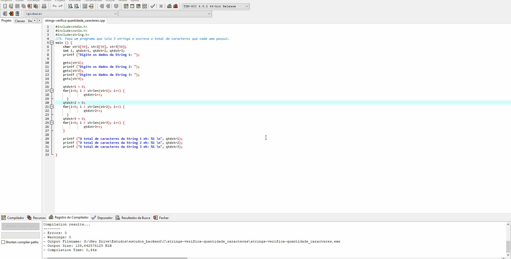

<h1 align="center">Strings</h1>

Projeto de estudo para praticar os conceitos de Strings aprendidos durante a disciplina de Algoritmos e Lógica de Programação da faculdade.

<h2>Problema</h1>
Faça um programa que leia 3 strings e escreva o total de caracteres que cada uma possui.

<h2> Neste projeto pratiquei os seguintes conceitos de programação: </h2>

- Arrays
- Função GETS
- Estrutura de repetição

<h1 align="center">Print do Resultado</h1>

<h2 align="center">Tecnologias Usadas</h2>

     
 
        
    

