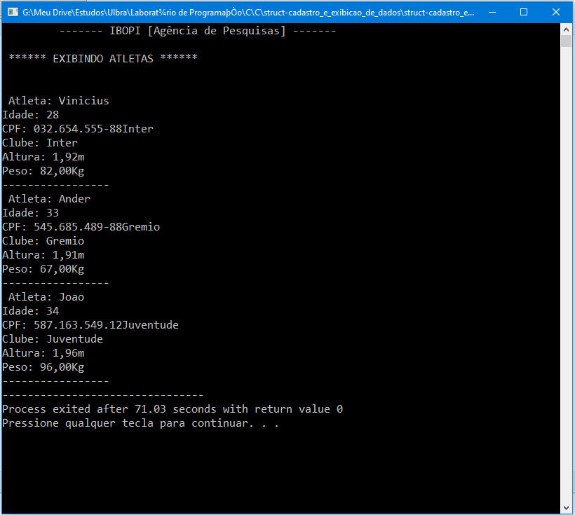

<h1 align="center">Cadastro e Exibição de uma Estrutura</h1>

Projeto de estudo para praticar os conceitos aprendidos durante a disciplina de Algoritmos e Lógica de Programação da faculdade.

<h2>Problema</h1>
A agência de pesquisas “IBOPI” precisa de um programa para cadastrar os
dados dos atletas de vôlei do Rio Grande do Sul. As informações a serem
armazenadas, para cada atleta são: CPF, nome do clube em que joga, nome
do atleta, idade, altura e peso. Além de cadastrar os atletas, o programa
deverá oferecer a listagem de todos os dados dos atletas agrupados por
clube. Usar vetor de registros. Cadastrar no mínimo 3 atletas.

<h2> Neste projeto pratiquei os seguintes conceitos de programação: </h2>

- Variáveis e Constantes
- Estruturas de repetições
- Funções com retorno e passagem por referência
- Função GETS
- Estruturas - Struct

<h1 align="center">Print do Resultado</h1>

<h2 align="center">Tecnologias Usadas</h2>

     
 
        
    

