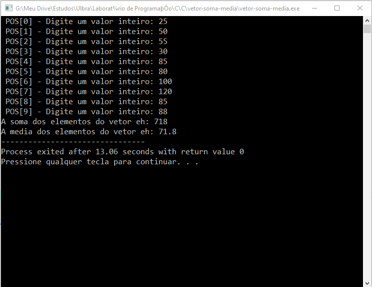

<h1 align="center">Média da Somatória do Vetor </h1>

Projeto de estudo para praticar os conceitos aprendidos durante a disciplina de Algoritmos e Lógica de Programação da faculdade.

<h2>Problema</h1>
Escreva um programa que leia um vetor de 10 posições de inteiros e apresente o somatório e a média aritmética de todos os valores.

<h2> Neste projeto pratiquei os seguintes conceitos de programação: </h2>

- Variáveis e Constantes
- Estruturas de repetições
- Funções com retorno e passagem por referência

<h1 align="center">Print do Resultado</h1>

<h2 align="center">Tecnologias Usadas</h2>

     
 
        
    

