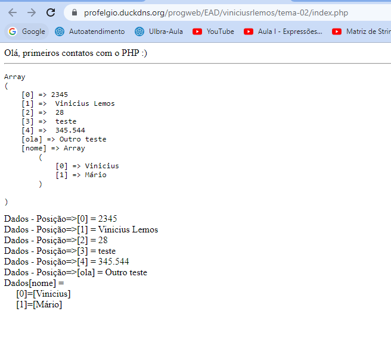

<h1 align="center">Praticando Arrays em PHP</h1>

Projeto de estudo para dar os primeiros passos com PHP, utilizando os Arrays.

- Praticando Arrays e Laços de repetições

<h3> Projeto desenvolvido no dia 18/10/2022. </h3>

<h1 align="center">Print do Resultado</h1>

<h2 align="center">Tecnologias Usadas</h2>

     
        
       
       
       
    

