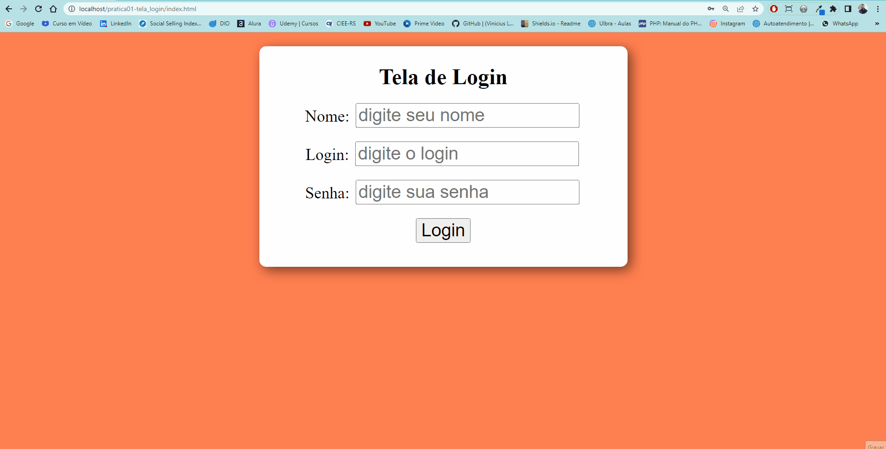

<h1 align="center">Tela de Login - Pegando Dados de Formulário em PHP</h1>

Projeto de estudo para capturar dados de formulários HTML, através do método POST.

- Passando dados através do método Post
- Criado um array de login de teste

<h3> Projeto desenvolvido no dia 31/10/2022. </h3>
Esta é a primeira versão desta tela, logo estarei implementando ela.

<h1 align="center">Gif do Resultado</h1>

<h2 align="center">Tecnologias Usadas</h2>

     
        
       
       
       
    

