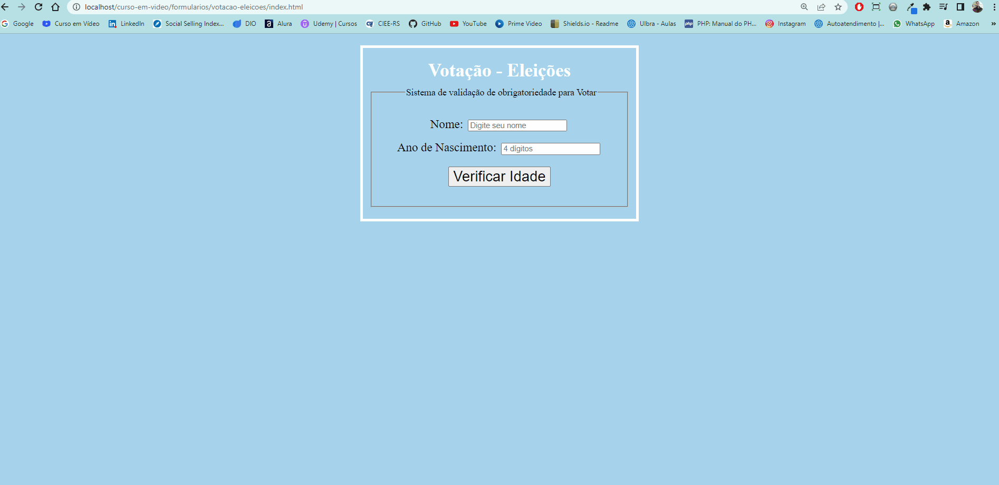

<h1 align="center">Votação - Pegando Dados de Formulário em PHP</h1>

Projeto de estudo para capturar dados de formulários HTML, durante o curso de PHP do Curso em Vídeo.

- Passando dados através do método GET
- Se a idade for menor que 16 - <strong>Não vota</strong>
- Se a idade for maior que 16 e menor que 18 ou maior que 65 - <strong>Voto opcional</strong>
- Se a idade for entre 18 e 65 - <strong>Voto obrigatório</strong>
- Se a idade for maior que 65 - <strong>Voto opcional</strong>

<h3> Projeto desenvolvido no dia 27/10/2022. </h3>

<h1 align="center">Gif do Resultado</h1>

<h2 align="center">Tecnologias Usadas</h2>

     
        
       
       
       
    

